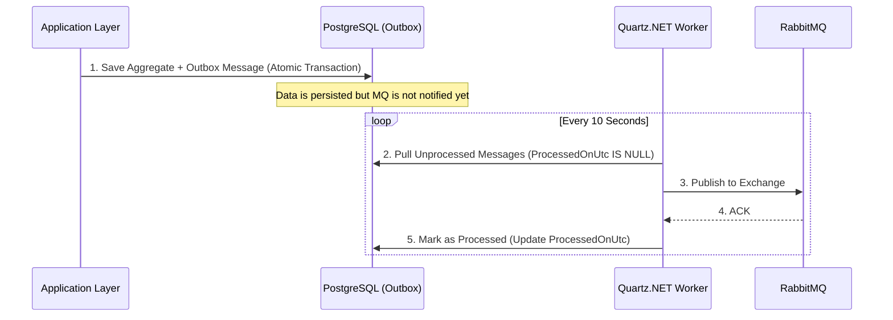

# Transactional Outbox Implementation

This document describes how the Transactional Outbox pattern is implemented in the Bus Ticketing System to ensure reliable messaging and eventual consistency between microservices.

## Overview
The **Transactional Outbox** ensures that a domain event is never lost. It guarantees that the database update and the message publication either both succeed or both fail, avoiding the "dual-write" problem.

### Key Components
1.  **Outbox Table**: A specialized table (`outbox_messages`) stores events as serialized JSON.
2.  **DbContext Interception**: `BookingDbContext` overrides `SaveChangesAsync` to automatically convert domain events into outbox messages within the same transaction.
3.  **Background Worker**: A Quartz.NET job (`ProcessOutboxMessagesJob`) polls the table and publishes messages to RabbitMQ.
4.  **Idempotency**: Consumers are expected to handle duplicate messages (at-least-once delivery).

## Process Flow (Sequence Diagram)

## Retry and Error Handling
The implementation relies on **eventual consistency** and handles failures through automatic polling:

| Status | Outcome |
| :--- | :--- |
| **Transient Failure** (e.g., RabbitMQ Down) | The worker fails to publish. `ProcessedOnUtc` remains `NULL`. The message is picked up again in 10 seconds. |
| **Technical Error** (e.g., Serialization) | The worker catches the exception, logs it in the `Error` column, and keeps `ProcessedOnUtc` as `NULL`. |
| **Max Retries** | Currently, the worker retries indefinitely. In a production environment, a `RetryCount` and "Dead Letter Outbox" strategy would be added. |

## Why this approach?
- **Zero Message Loss**: Even if the API crashes after saving to the DB, the message remains in the outbox to be sent later.
- **Performance**: The API doesn't wait for RabbitMQ before responding to the user.
- **Order Guarantees**: Messages are processed in the order they occurred (`OccurredOnUtc`).
